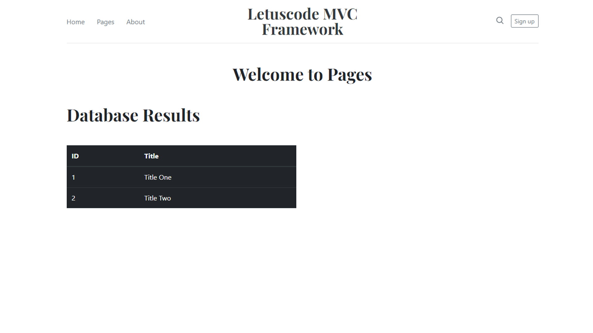

# PHP MVC OOP Framework from scratch

```
> git clone https://github.com/jwill9999/letuscodemvc.git
> cd letuscodemvc
> run in apache serve 
```

## Project view




## Description

Object orientated php framework from scratch using the MVC design pattern. 


## Root of application
> Public/index.php

## Application Bootstrap from
> app/bootstrap.php 

## Configuration files
> app/config/config
